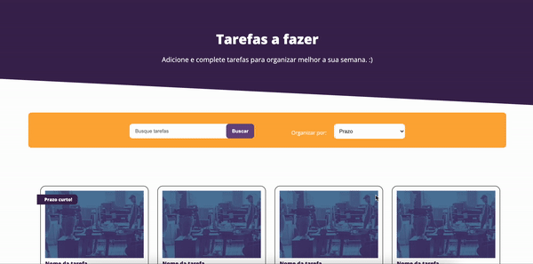

# Desafio Web Design Linx

Este repositório foi criado para publicar meu teste do desafio Web Design da Linx.

Para acessar o desafio, [cliquei aqui.](https://desafio-webdesigner-linx.netlify.app/)

## Preview

Abaixo, você poderá ver como ficou o resultado, tanto mobile quanto desktop.

- Mobile

  

 

- Desktop

  
  
   

## Tecnologias

- HTML5
- CSS3

## Como executar

- Clonar o projeto na sua máquina;
- Abrir o arquivo index.html no seu navegador ou utilizar o [Live Server](https://marketplace.visualstudio.com/items?itemName=ritwickdey.LiveServer);
